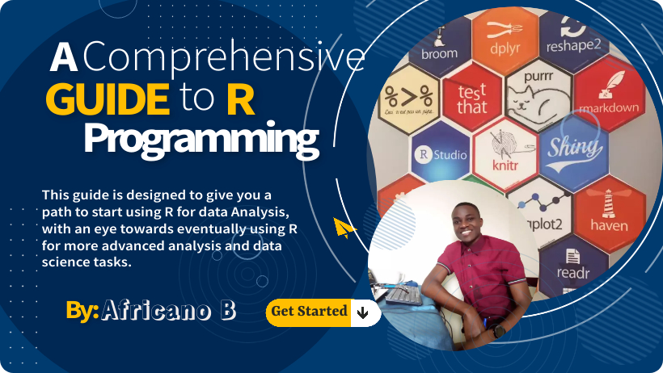

# A Comprehensive guide to R pragramming

{width="100%"}

This is A comprehensive guide to use R, that is & will be updated continouslyof new content about R.The Aim is not for Super and Advanced Masterly as is a broad Programming Language; but giving you a path to Advanced Use.
the Topics covered include; Getting Started, OPerators, Data Structure,Working withh data, Data Visualisation, Statistical modelling and machine Learning
